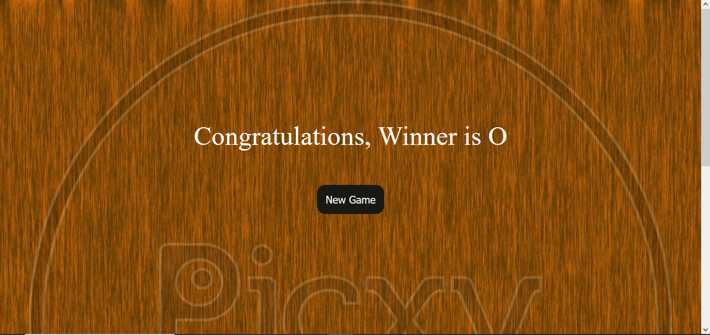
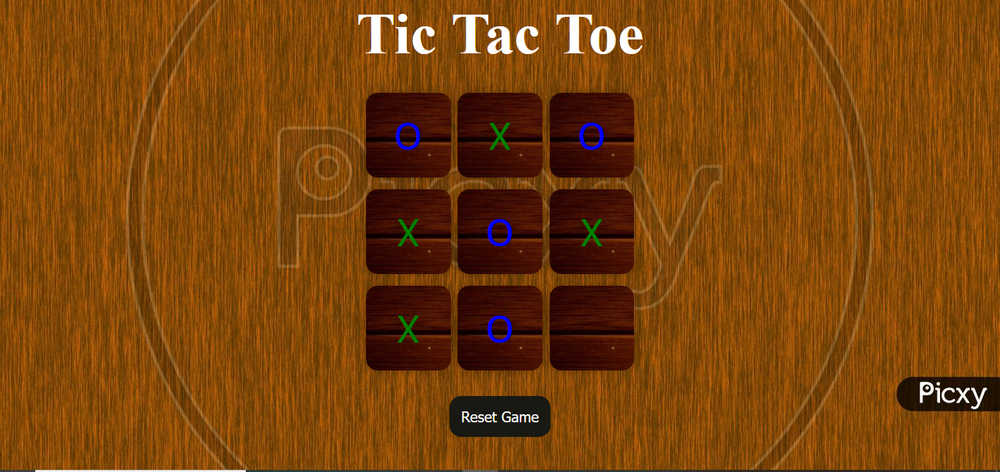

# 🎮 Tic Tac Toe Game

A simple and interactive **Tic Tac Toe** game built using **HTML**, **CSS**, and **JavaScript**. Playable in any modern browser with smooth UI and responsive design.

---

[](assets/Screenshot1.png)
[](assets/Screenshot.png)
---

## 🔗 Live Demo

👉 [Play Now](file:///C:/Users/acer/Desktop/JavaScript/project1/project1.html)


---

## 🛠️ Tech Stack

- HTML5
- CSS3
- JavaScript (Vanilla JS)

---

## 📌 Features

- ✔️ Two-player mode
- ✔️ Win, lose, draw detection
- ✔️ Reset/Replay option
- ✔️ Fully responsive layout
- ✔️ Clean and minimal UI

---

## 🚀 How to Run Locally

```bash
# Clone the repository
git clone https://github.com/your-username/tic-tac-toe-js.git

# Navigate into the directory
cd tic-tac-toe-js

# Open in browser
Open index.html in your browser
